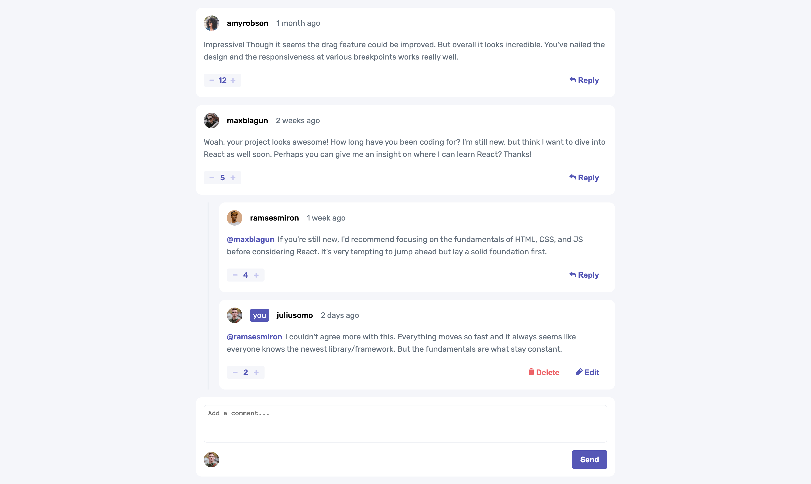

# comments

This is a solution to the [Interactive comments section challenge on Frontend Mentor](https://www.frontendmentor.io/challenges/interactive-comments-section-iG1RugEG9). Frontend Mentor challenges help you improve your coding skills by building realistic projects.

## Overview

### Screenshot



### Links

- [live](https://cyh-comments.netlify.app/)
- [github](https://github.com/cyhfe/frontend-mentor/tree/main/comment)

## My process

### Built with

- Reactjs
- emotion

### What I learned

#### 嵌套对象不可变更新

> Redux 文档

```js
function updateVeryNestedField(state, action) {
  return {
    ...state,
    first: {
      ...state.first,
      second: {
        ...state.first.second,
        [action.someId]: {
          ...state.first.second[action.someId],
          fourth: action.someValue,
        },
      },
    },
  }
}

function updateObjectInArray(array, action) {
  return array.map((item, index) => {
    if (index !== action.index) {
      // This isn't the item we care about - keep it as-is
      return item
    }

    // Otherwise, this is the one we want - return an updated value
    return {
      ...item,
      ...action.item,
    }
  })
}
```

#### 状态管理和组件设计

comment 有多层嵌套,我选择用 context 管理状态

更新状态的方法定义在 comstom hooks 中

这样方便管理,也避免重复传 props

组件的设计上,注重关注点分离.

把组件用容器组件和展示组件区分开.

评论和回复有着类似的结构.

为了复用评论和回复组件,我做了很多工作.

```jsx
function StyledCard({ dataSource, type, showReply, isSelf }) {
  const renderScore = (type) => {
    return type === "comment" ? <CommentScore /> : <ReplyScore />
  }

  const renderContent = (type) => {
    return type === "comment" ? <CommentContent /> : <ReplyContent />
  }

  const renderAvatar = (type) => {
    return type === "comment" ? <CommentAvatar /> : <ReplyAvatar />
  }
  // ...
}
```

还实现了 2 个通用组件`Modal`, `Button`

### 总结

我对`Escape Tutorial Hell`这个观点非常认同.

我看了许多文章,视频,教程. 但是模仿只是前期阶段.

当你脱离指导,真正开始构建应用时,会碰到许多问题.

运用你的知识储备来解决问题,会有更好的成长.
