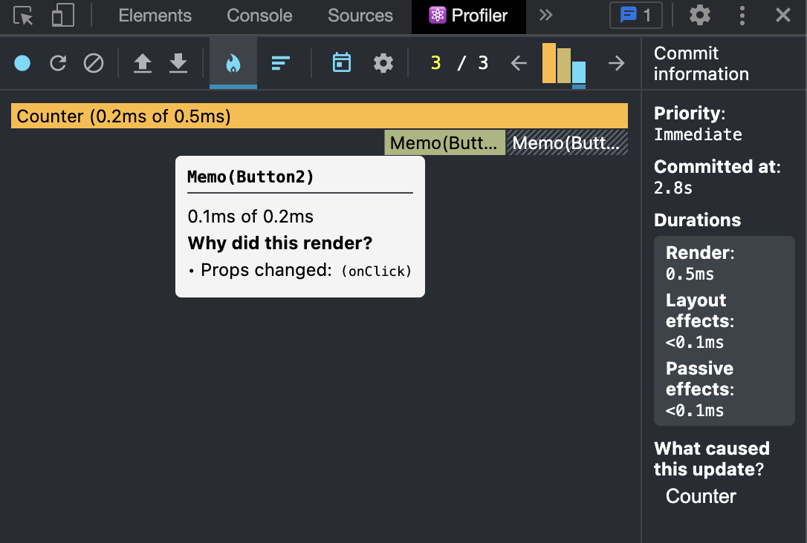

# 函数作为 prop 或者依赖时的重新渲染问题

在 React 中，当状态改变时，会重新调用组件函数。所以在组件中定义的函数每次渲染都会重新定义。直接使用 useCallback 空依赖的话拿不到最新的值。

可以用 ref 保存函数，不会导致重新渲染。在 useEffect 中更新函数，返回的函数用 useCallback 空依赖缓存。

这样就可以实现稳定不变的函数，并且可以拿到最新的状态。

[https://codesandbox.io/s/awesome-rubin-q157of?file=/src/App.js](https://codesandbox.io/s/awesome-rubin-q157of?file=/src/App.js)



## useStableCallback

```jsx
import React from "react";
import { useEffect, useRef } from "react";

function useStableCallback(callback) {
  const savedCallback = useRef(callback);
  useEffect(() => {
    savedCallback.current = callback;
  }, [callback]);
  return React.useCallback(function () {
    savedCallback.current();
  }, []);
}

function Counter() {
  const [count, setCount] = React.useState(0);

  function inc() {
    setCount(count + 1);
    console.log(count);
  }

  const savedInc = useStableCallback(inc);

  return (
    <div>
      <div>{count}</div>
      <Button onClick={inc} />
      <Button onClick={savedInc} />
    </div>
  );
}

// 父组件渲染也会导致子组件渲染，这里用React.memo控制变量，只有props改变才会重新渲染

const Button = React.memo(function Button({ onClick }) {
  return <button onClick={onClick}>+</button>;
});

export default Counter;
```

## 参考文章

[https://overreacted.io/making-setinterval-declarative-with-react-hooks/](https://overreacted.io/making-setinterval-declarative-with-react-hooks/)
