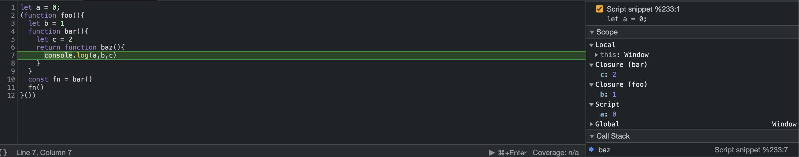

# js 是如何查找变量的

我在想:如果面试问我闭包, 作用域我会怎么回答?

不去扯那些概念,按我的体会来说,我觉得这个问题可以转换为:js 是如何查找变量的.

先说结论: js 先从闭包查找变量,然后顺着作用域链查找.

写段 demo 验证一下

```js
let a = 0
;(function foo() {
  let b = 1
  function bar() {
    let c = 2
    return function baz() {
      console.log(a, b, c)
    }
  }
  const fn = bar()
  fn()
})()
```



现象:

c 在 bar 的闭包中

b 在 foo 的闭包中

a 通过作用域链访问

解释:

- 如何创建闭包
  - 函数可以作为返回值
  - 函数返回值被外部引用(使用变量保存下来)
- 问题
  - 函数是基于词法作用域的(查找变量取决于函数定义时的位置),
  - 变量是保存在函数的执行上下文中
  - 但是闭包函数调用时, 创建闭包的函数已经推出调用栈,执行环境也销毁了,那我们要怎么查找变量呢?
- 如何解决
  - 函数中引用的变量(只有引用的变量会保存)会复制到堆中(这个堆是保存返回值的上下文环境, 堆就是一块保存数据的内存空间. 闭包的数据只有该函数可以访问)
