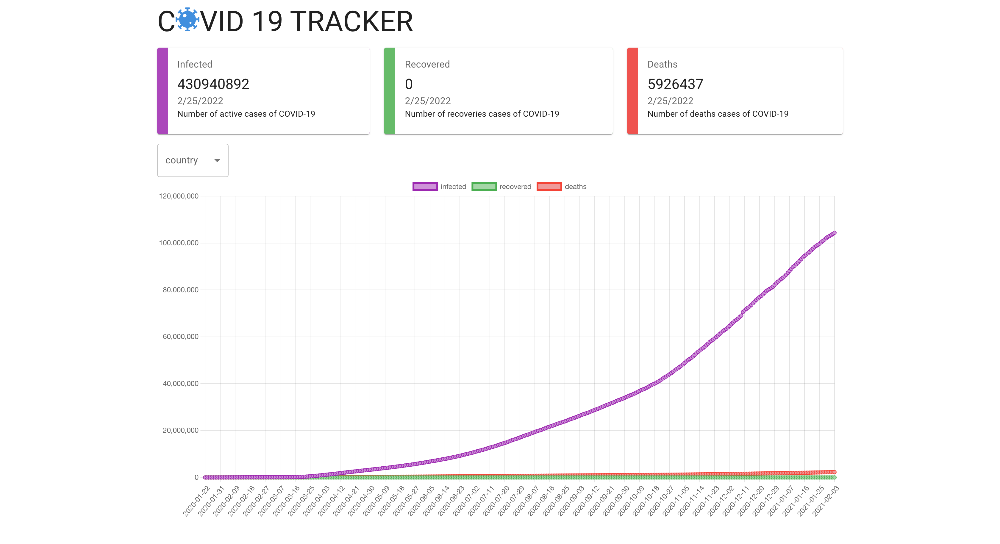

# Covid-19 tracker

[live](https://cyh-covid19-tracker.netlify.app/)

[code](https://github.com/cyhfe/covid19-tracker)
## 技术选择

react hooks, react-chartjs-2, mui
## 实现功能

使用`https://covid19.mathdro.id/api`的数据进行图表展示.

根据选择的`country`切换不同的图表及数据.

