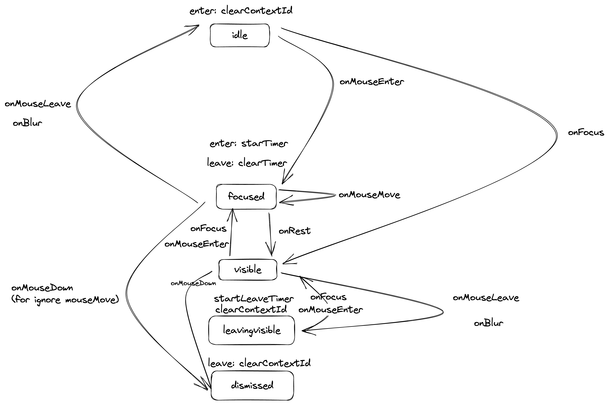

# 用状态机处理复杂的 UI 状态

## 什么是状态机

[https://statecharts.dev/what-is-a-state-machine.html](https://statecharts.dev/what-is-a-state-machine.html)

An abstract state machine is a software component that defines a finite set of states:
One state is defined as the initial state. When a machine starts to execute, it automatically enters this state.
Each state can define actions that occur when a machine enters or exits that state. Actions will typically have side effects.
Each state can define events that trigger a transition.
A transition defines how a machine would react to the event, by exiting one state and entering another state.
A transition can define actions that occur when the transition happens. Actions will typically have side effects.
When “running” a state machine, this abstract state machine is executed. The first thing that happens is that the state machine enters the “initial state”. Then, events are passed to the machine as soon as they happen. When an event happens:

The event is checked against the current state’s transitions.
If a transition matches the event, that transition “happens”.
By virtue of a transition “happening”, states are exited, and entered and the relevant actions are performed
The machine immediately is in the new state, ready to process the next event.

## 实现状态机

```tsx
// 状态图
// initialState： 有个初始状态，状态机开始运行时进入这个状态
// actions： 每个状态都有进入和退出的副作用
// transitions： 根据对应的事件，转换到另一个状态target。这个状态也有副作用action

const chart = {
  initialState: MachineValue.OFF,
  states: {
    [MachineValue.OFF]: {
      actions: {
        onEnter: () => {
          console.log("enter off");
        },
        onExit: () => {
          console.log("exit off");
        },
      },
      transitions: {
        [MachineEvents.SWITCH]: {
          target: MachineValue.ON,
          action: () => {
            console.log("switch from off to on");
          },
        },
      },
    },
    [MachineValue.ON]: {
      actions: {
        onEnter: () => {
          console.log("enter on");
        },
        onExit: () => {
          console.log("exit on");
        },
      },
      transitions: {
        [MachineEvents.SWITCH]: {
          target: MachineValue.OFF,
          action: () => {
            console.log("switch from on to off");
          },
        },
      },
    },
  },
};
```

```tsx
// 状态机
interface MachineDedinition<
  MachineStates extends string,
  MachineEvents extends string
> {
  initialState: MachineStates;

  states: {
    [MachineState in MachineStates]?: {
      actions?: {
        onEnter?: () => void;
        onExit?: () => void;
      };
      transitions?: {
        [MachineEvent in MachineEvents]?: {
          target?: MachineStates;
          action?: () => void;
        };
      };
    };
  };
}

function createMachine<
  MachineStates extends string,
  MachineEvents extends string
>(machineDedinition: MachineDedinition<MachineStates, MachineEvents>) {
  let machine = {
    state: machineDedinition.initialState,
    subscriptions: new Set<Function>([]),
    subscribe(fn: Function) {
      this.subscriptions.add(fn);
      return () => {
        this.subscriptions.delete(fn);
      };
    },
    notify() {
      this.subscriptions.forEach((cb) => cb());
    },

    send(event: MachineEvents) {
      let { change } = this.transition(event);
      if (change) {
        this.notify();
      }
    },

    transition(event: MachineEvents) {
      const currentState = this.state;
      const nextState =
        machineDedinition.states[currentState]?.transitions?.[event]?.target;

      if (!nextState) {
        return {
          state: currentState,
          change: false,
        };
      }

      machineDedinition.states[currentState]?.actions?.onExit?.();
      this.state = nextState;
      machineDedinition.states[currentState]?.transitions?.[event]?.action?.();
      machineDedinition.states[nextState]?.actions?.onEnter?.();
      return {
        state: this.state,
        change: true,
      };
    },
  };
  return machine;
}

export { createMachine };
```

```tsx
//使用
const machine = createMachine<MachineValue, MachineEvents>(chart);

machine.subscribe(() => {
  console.log("notify: current state " + machine.state);
});

machine.send(MachineEvents.SWITCH);
machine.send(MachineEvents.SWITCH);
```

## 用状态机实现 tooltip



```tsx
const chart = {
  initialState: TooltipStates.Idle,
  states: {
    [TooltipStates.Idle]: {
      actions: {},
      transitions: {
        [TooltipEvents.MouseEnter]: {
          target: TooltipStates.Focused,
        },
        [TooltipEvents.Focus]: {
          target: TooltipStates.Visible,
        },
      },
    },
    [TooltipStates.Focused]: {
      actions: {
        onEnter: startRestTimer,
        onExit: clearRestTimer,
      },
      transitions: {
        [TooltipEvents.MouseMove]: {
          target: TooltipStates.Focused,
        },
        [TooltipEvents.MouseLeave]: {
          target: TooltipStates.Idle,
        },
        [TooltipEvents.MouseDown]: {
          target: TooltipStates.Dismissed,
        },
        [TooltipEvents.Blur]: {
          target: TooltipStates.Idle,
        },
        [TooltipEvents.Rest]: {
          target: TooltipStates.Visible,
        },
      },
    },
    [TooltipStates.Visible]: {
      transitions: {
        [TooltipEvents.Focus]: {
          target: TooltipStates.Focused,
        },
        [TooltipEvents.MouseEnter]: {
          target: TooltipStates.Focused,
        },
        [TooltipEvents.MouseLeave]: {
          target: TooltipStates.LeavingVisible,
        },
        [TooltipEvents.Blur]: {
          target: TooltipStates.LeavingVisible,
        },
        [TooltipEvents.MouseDown]: {
          target: TooltipStates.Dismissed,
        },
      },
    },
    [TooltipStates.LeavingVisible]: {
      actions: {
        onEnter: startLeavingVisibleTimer,
        onExit: () => {
          clearLeavingVisibleTimer();
        },
      },
      transitions: {
        [TooltipEvents.MouseEnter]: {
          target: TooltipStates.Visible,
        },
        [TooltipEvents.Focus]: {
          target: TooltipStates.Visible,
        },
        [TooltipEvents.TimeComplete]: {
          target: TooltipStates.Idle,
        },
      },
    },
    [TooltipStates.Dismissed]: {
      actions: {
        onEnter: startLeavingVisibleTimer,
      },
      transitions: {
        [TooltipEvents.MouseLeave]: {
          target: TooltipStates.Idle,
        },
        [TooltipEvents.Blur]: {
          target: TooltipStates.Idle,
        },
      },
    },
  },
};
```

## 参考文章

[https://kentcdodds.com/blog/implementing-a-simple-state-machine-library-in-javascript](https://kentcdodds.com/blog/implementing-a-simple-state-machine-library-in-javascript)
