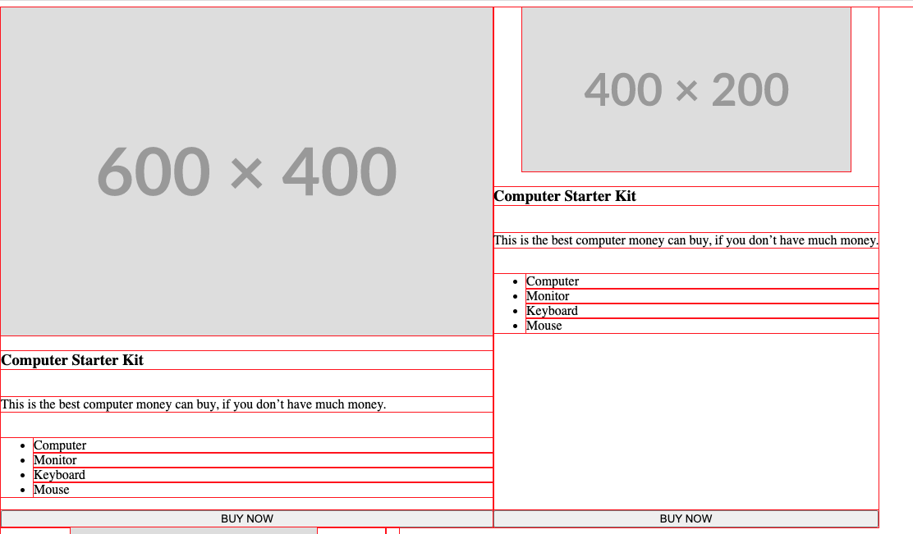

# 读 flex 规范

> /_ Flex layout so items have equal height _/

flex items 默认会撑开高度(以最高的为准)



默认图片会撑开宽度 `align-self:center`居中且保持原有宽度

```html
<div style="display:flex">
  <!-- flex item: block child -->
  <div id="item1">block</div>

  <!-- flex item: floated element; floating is ignored -->
  <div id="item2" style="float: left;">float</div>

  <!-- flex item: anonymous block box around inline content -->
  anonymous item 3

  <!-- flex item: inline child -->
  <span>
    item 4
    <!-- flex items do not split around blocks -->
    <q style="display: block" id="not-an-item">item 4</q>
    item 4
  </span>
</div>
```

> A flex item establishes an independent formatting context for its contents. However, flex items themselves are flex-level boxes, not block-level boxes: they participate in their container’s flex formatting context, not in a block formatting context.

相邻的 flex 项目的 margin 不会折叠。
与块级盒子一样，flex 项目上的百分比 margin 和 padding 是相对于其包含块的内联尺寸来计算的，
自动 margin 会扩展额外空间。它们可以用于对齐，或将相邻的 flex 项目分开。

> By default, flex items won’t shrink below their minimum content size (the length of the longest word or fixed-size element). To change this, set the min-width or min-height property.
