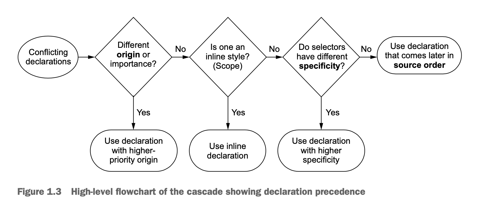
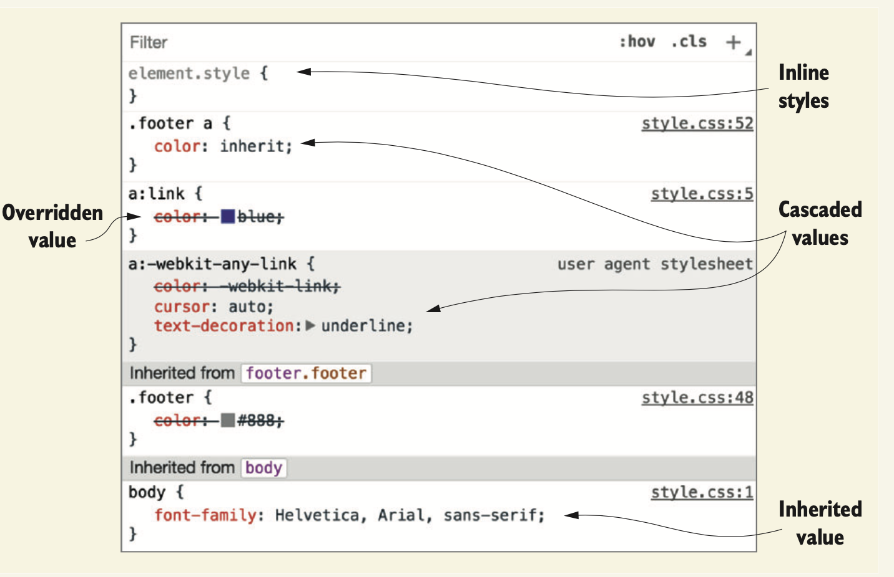

- [1. cascade, specificity and inheritance](#1-cascade-specificity-and-inheritance)
  - [1.1 cascade](#11-cascade)
    - [1.2 understanding specificity](#12-understanding-specificity)
    - [1.3 understanding source order](#13-understanding-source-order)
      - [link styles](#link-styles)
    - [1.4 two rules of thumb](#14-two-rules-of-thumb)
- [2 inheritance](#2-inheritance)
- [3 special values](#3-special-values)
  - [3.1 using the inherit ketword](#31-using-the-inherit-ketword)

# 1. cascade, specificity and inheritance

## 1.1 cascade

origin >> specificity >> order

###s 1.1.1 understanding stylesheet origin

1. author important
2. author
3. user agent
   
### 1.2 understanding specificity

the browser evaluates specifity in two parts: 
- inline styles
  - no selector, directly to the element 
- selector specificity
  - id
  - class
  - element

### 1.3 understanding source order

#### link styles

link >> visited >> hover >> active

### 1.4 two rules of thumb

1. dont use id in your selector
2. dont use !important

# 2 inheritance 

In general, these are the properties you’ll want to be inherited. They are primarily properties pertaining to text: color, font, font-family, font-size, font-weight, font-variant, font-style, line-height, letter-spacing, text-align, text-indent, text-transform, white-space, and word-spacing.

A few others inherit as well, such as the list properties: list-style, list-style -type, list-style-position, and list-style-image. The table border properties, border-collapse and border-spacing

inheritance << cascade

# 3 special values
## 3.1 using the inherit ketword
Sometimes, you’ll want inheritance to take place when a cascaded value is preventing it. To do this, you can use the keyword inherit. You can override another value with this, and it will cause the element to inherit that value from its parent.

You can also use the inherit keyword to force inheritance of a property not normally inherited,

