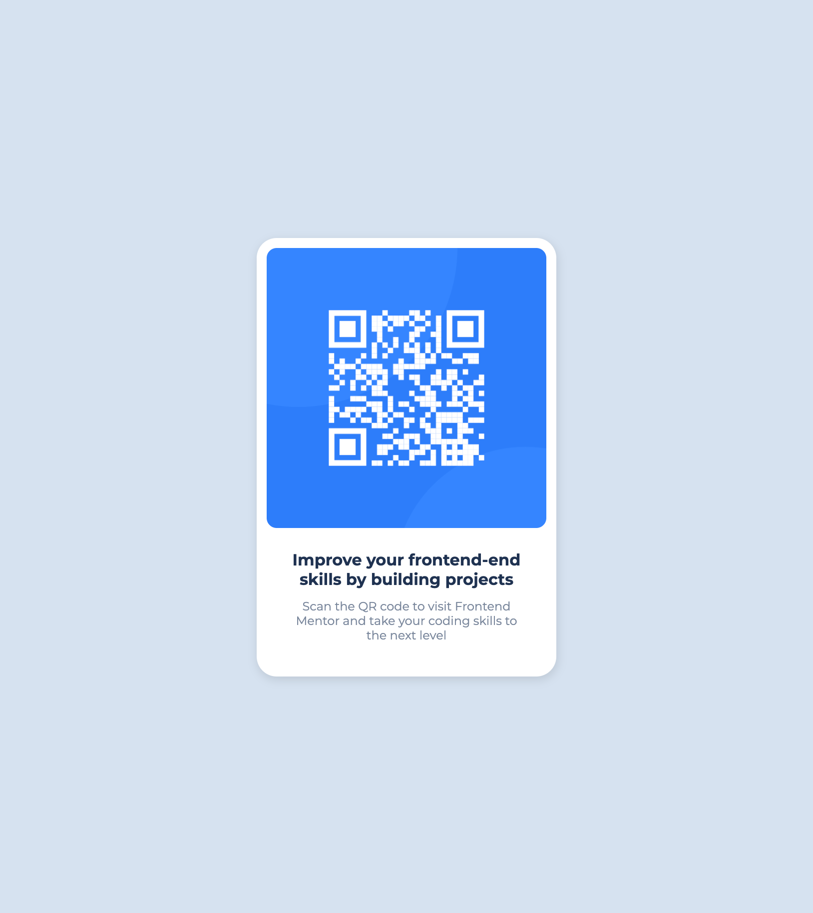

# QR code

## Overview

### Screenshot



### Links

- [live demo](https://cyh-qr-code.netlify.app/)
- [code](https://github.com/cyhfe/frontend-mentor/tree/main/qr-code-component-main)

## My process

### Built with

- Semantic HTML5 markup
- CSS custom properties
- Flexbox

### What I learned

css 变量

```css
:root {
  --white: hsl(0, 0%, 100%);
  --light-gray: hsl(212, 45%, 89%);
  --grayish-blue: hsl(220, 15%, 55%);
  --dark-blue: hsl(218, 44%, 22%);
}
```

### Useful resources
