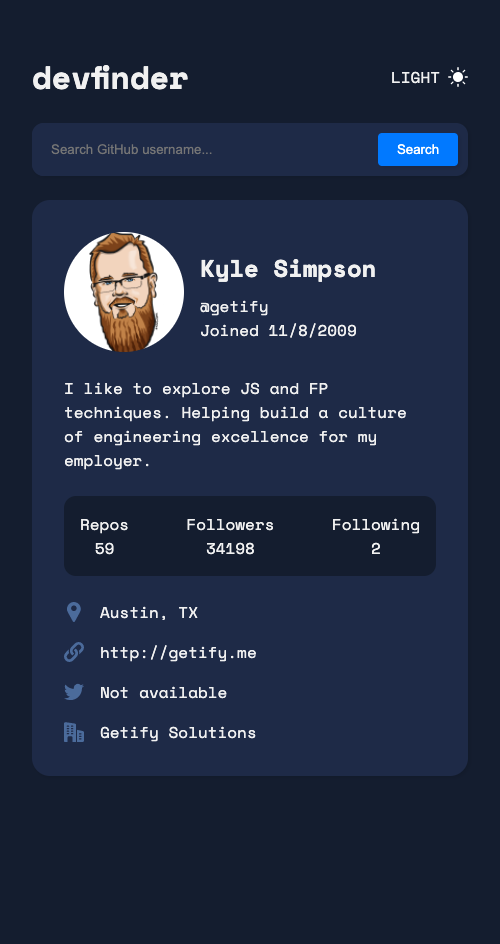

# Github user search

- Dark



- Light


使用 github user api,通过 fetch 获取数据展示页面.

使用 react 构建 UI 界面

emotion 实现样式以及主题切换

## 主题切换

```js
export function ThemesProvider({ children }) {
  const [theme, setTheme] = useState("dark")
  const value = [theme, setTheme]
  return (
    <ThemesContext.Provider value={value}>
      <ThemeProvider theme={themes[theme]}>{children}</ThemeProvider>
    </ThemesContext.Provider>
  )
}
```

```js
const themes = {
  light: {
    colors: {
      colorHightlight: "black",
      color: "#4B6A9B",
      background: "#F6F8FF",
      backgroundContent: "#FEFEFE",
    },
  },
  dark: {
    colors: {
      colorHightlight: "white",
      color: "#f1f1f1",
      background: "#141D2F",
      backgroundContent: "#1E2A47",
    },
  },
}
```

```js
const StyledApp = styled.div`
  color: ${(props) => props.theme.colors.color};
  background-color: ${(props) => props.theme.colors.background};
  ...
`
```

##
