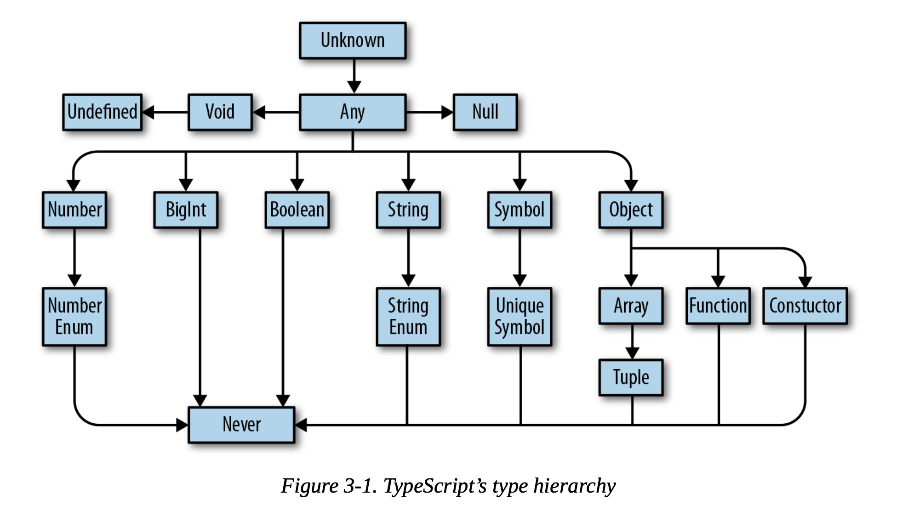

# All About Types

## hierarchy



## The ABCs of Types

### any

any is the set of all values.

tsconfig: `noImplicitAny`

### unknown

```ts
// TypeScript will never infer something as unkonwn 
let a: unknown = 30 // unkonwn

// You can compare values to values that are of type unkonwn(b)
let b = a === 123 // boolean

// But, you can't do things that assume an unkonw value is of a specific type
let c = a + 10 // Error

// you have to prove to TypeScript that the value really is of that type first.
if(typeof a === 'number') {
  let d = a + 10
}
```

### object 

> Structural typing: A style of programming where you just care that an object has certain properties, and not what its name is (nominal typing). Also called duck typing in some languages (or, not judging a book by its cover).

```ts
// object is a little narrower than , but not by much. doesn’t tell you a lot about the value it describes, just that the value is a JavaScript object
let a: object = {
  b: "x",
}

console.log(a.b) // Error


let a: {
  b: number
  c?: string
  [key: number]: boolean
}

```

### Type Operation: Type Aliases, Unions, and Intersections
1. Type Aliases
  
Type aliases are useful for DRYing up repeated complex types

```ts
// type aliases are block-scoped
type Color = 'red'
type Color = 'blue' // Duplicate identifier 'Color'.ts(2300)

```

2. Union and intersection types

```ts
type Cat = {
  name: string
  purrs: boolean
}

type Dog = {
  name: string
  barks: boolean
  wags: boolean
}

type CatOrDogOrBoth = Cat | Dog
type CatAndDog = Cat & Dog

// Cat
let a: CatOrDogOrBoth = {
  name: "Bonkers",
  purrs: true,
}

// Dog
a = {
  name: "Domino",
  barks: true,
  wags: true,
}

// Both
a = {
  name: "Donkers",
  barks: true,
  purrs: true,
  wags: true,
}

let b: CatAndDog = {
  name: 'Domino',
  barks: true,
  purrs: true,
  wags: true
}
```

### null, undefined, void, never

```ts
// number | null
function a(x: number) {
  if (x < 10) {
    return x
  }
  return null
}

// undefined
function b() {
  return undefined
}

// void
function c() {
  let a = 4
}

// never
function d() {
  throw TypeError("never")
}

function e() {
  while (true) {}
}

```

### Enums

```json
{
  "compilerOptions": {
    // ...
    "preserveConstEnums": true
  },
}

```

```ts
enum Language {
  English,
  Spanish,
  Chinese,
}

let a = Language.English
```

```js
var Language;
(function (Language) {
    Language[Language["English"] = 0] = "English";
    Language[Language["Spanish"] = 1] = "Spanish";
    Language[Language["Chinese"] = 2] = "Chinese";
})(Language || (Language = {}));
let a = Language.English;
```
